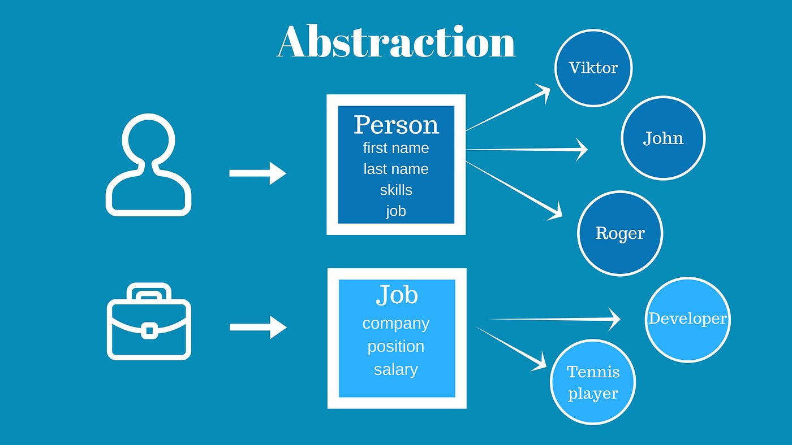

### Abstraction nimani anglatadi?



Abstraction bu murakkablikni ortiqcha detallar, ma'lum bir jarayonga muhim bo'lmagan elementlarni olib tashlash orqali osonlashtirish tushuniladi. Bu dasturchilarga ortiqcha detallar haqida qayg'urmasdan faqatgina hal qilinishi kerak bo'lgan muammoga focus qaratishga yordam beradi.

Real hayotdan misol oladigan bo'lsak, siz ertalab turib kofe ichmoqchisiz. Suv va o'zingiz xohlagan miqdorda kofe olib ularni kofe tayyorlaydigan mashinaga qo'yasiz. Sizning vazifangiz faqat shu. Suv va kofeni olib uni mashinaga berish va ertalab turganingizda faqat shu ishlarni qilishga focus qaratishingiz kerak bo'ladi. Lekin siz mashina ichki mexanizmida kofeni tayyorlash jarayonini bilishingiz shart emas, chunki u nima bo'lgan taqdirda ham sizga kofe tayyorlab bera oladi, unga faqat suv va kofeni bersangiz kifoya. Kofe tayyor bo'lishi uchun suv necha gradusda qaynashi kerakligi, kofeni qanday qilib to'g'ri maydalash va filtrlash kerakligi haqida umuman qayg'urmasangiz ham bo'ladi.

Abstractionni amalda qo'llash uchun bir nechta yo'llar mavjud

##### Classes and Objects

```javascript
class Dog {
  constructor(name, breed) {
    this.name = name;
    this.breed = breed;
  }

  bark() {
    console.log("Woof!");
  }
}

const myDog = new Dog("Max", "Labrador");
myDog.bark(); // Abstraction: We don't need to know how bark() works internally.
```


##### Functions

```javascript
function calculateAverage(a, b) {
  return (a + b) / 2;
}

let x = 10;
let y = 30;

let averageOfXandY = calculateAverage(x, y);
console.log(averageOfXandY); // 20
```

Albatta, abstractionda biz bilishimiz shart bo'lmagan mexanizmni ham o'zimiz yozamiz. Lekin bu prinsip bizga shu mexanizmni har safar takrorlamaslikka, uni bir marta implement qilib, undan takror foydalanishimiz kerakligini tushuntiradi. Xuddi tepadagi misolga o'xshab.
