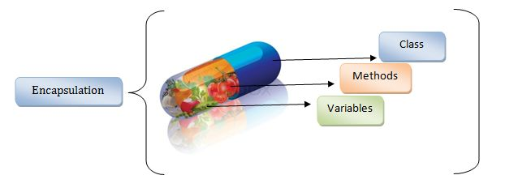

### Encapsulation nimani anglatadi?



Dasturlashda Encapsulation <i>(yoki inkapsulyatsiya)</i> classlarga bir xil umumiylikga ega bo'lgan property va methodlarni joylashtirish tushuniladi. Inkapsulyatsiya ortidagi asosiy g'oya objectning ichki holatiga **to'g'ridan-to'g'ri kirishni cheklash** va aniq belgilangan interfeyslar orqali boshqariladigan kirishni ta'minlashdir. Bu tamoyil ma'lumotlar yaxlitligiga, kod modulligiga va <a href="#">abstraktsiyaga</a> erishishga yordam beradi.

Inkapsulyatsiya object ichidagi ma'lumotlarning to'g'ridan to'g'ri ochiq holatda qolib ketmasligini, faqatgina maxsus va shu objectning ichida mavjud bo'lgan methodlar orqaligina undan foydalana olish xususiyatini ta'minlaydi. Bu o'zgaruvchilardan ruxsatsiz foydalanishni cheklashga yordam beradi.

JavaScript-da inkapsulyatsiyani `class` yordamida va `public` va `private` kabi access modifikatorlaridan foydalanish orqali ko'rsatish mumkin:

```javascript
class Person {
  #name; // Private member

  constructor(name) {
    this.#name = name; // Private property
  }

  #privateMethod() {
    // Private method
    console.log("This is a private method");
  }

  getName() {
    // Public method
    return this.#name;
  }
}

const person = new Person("John");
console.log(person.getName()); // Accessing public method
console.log(person.#name); // Error: Cannot access private member
person.#privateMethod(); // Error: Cannot access private method
```

Bu misolda `#name` propertysi va `#privateMethod` methodi maxfiy, ya'ni ulardan faqatgina `Person` classi ichidagina foydalanishimiz mumkin. `getName` methodi esa private ma'lumotlarga umumiy kirish nuqta rolini bajarib beradi.

Aslida bu prinsipni OOP dan tashqarida ham ishlatishimiz mumkin. Misol uchun <a href="https://developer.mozilla.org/en-US/docs/Web/JavaScript/Closures" target="_blank">closure</a> functionlarning g'oyasi ham OOP dagi encapsulationni eslatib yuboradi:

```javascript
function createCounter() {
  let count = 0;

  function increaseCount() {
    count++;
  }

  function getCount() {
    return count;
  }

  return { increaseCount, getCount };
}

const counter = createCounter();

counter.click(); // count: 1
counter.click(); // count: 2
counter.click(); // count: 3 

console.log(counter.getCount()); // Output: 3
```
Closure bu ma’lum bir funksiya ichida yozilgan internal funksiya bo’lib, bu turdagi funksiyalar ularni tashqi muhitdan qamrab olgan funksiyalar ichidagi ma’lum bir o’zgaruvchilarga ta’sir o’tkaza oladigan, va ular ustida amallar bajara oladigan funksiyalar hisoblanadi. Bundan tashqari bu funksiyalar chaqirilganidan keyin, ularni o'rab turgan scope ichidagi o'zgaruvchilardagi o'zgarishlarni **heap memory**ga saqlab qo'yadi