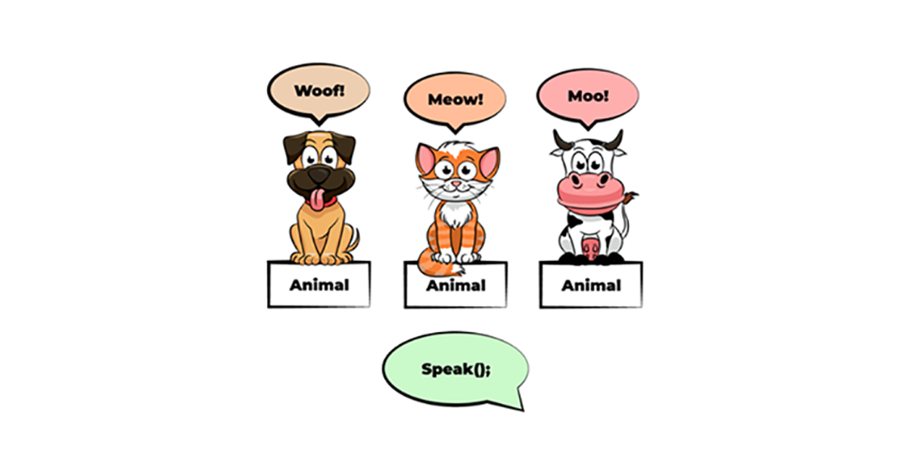

### Polymorphism nimani anglatadi?



Polimorfizm obektning turli shakllarni olish yoki bir nechta funksionallikga ega bo'lish qobiliyatini anglatadi. Dasturlash kontekstida polimorfizm har xil turdagi ob'ektlarni umumiy asosiy sinf yoki interfeys misollari sifatida ko'rib chiqishga imkon beradi.

Yanayam soddaroq tushundiradigan bo’lsak, bu ma’lum bir objectning boshqa bir object yoki classga umumiylik xususiyati mavjudligi orqali bir vaqtning o’zida bir qancha funksionallik va qiymatlarga ega bo’la olish qobiliyatini tushunishimiz mumkin.

Misol uchun erkak. Erkak bir vaqtning o’zida ham ishchi, ham ota va ham er bo’lishi kerak. Bu **Erkaklik** degan umumiy tushunchaga xos bo’lgan xususiyatlardir, va har bir erkak shu umumiylikdan me’ros oladi.

Yoki biron bir methodning mavjud objectlarda har xil vazifa bajarishi, misol uchun, parent classda mavjud bo'lgan methodni child class inherit qilib olishi va uni o'ziga mos yo'l bilan implementatsiya qilishi, overwrite qilishi tushuniladi.

Xuddi tepadagi rasmdagidek. Hamma hayvonlar 'gapira' oladi, faqat boshqacha ohang va shakllar bilan.

```javascript
class Animal {
  constructor(name) {
    this.name = name;
  }

  // Method that can be overridden by child classes
  makeSound() {
    console.log("The animal makes a sound.");
  }
}

class Dog extends Animal {
  makeSound() {
    console.log("Woof!");
  }
}

class Cat extends Animal {
  makeSound() {
    console.log("Meow!");
  }
}

// Polymorphism in action
const animals = [new Dog("Buddy"), new Cat("Whiskers")];
animals.forEach((animal) => {
  animal.makeSound();
});
```

Bu misolda `Dog` va `Cat` classlari `Animal` classidan `extends` keywordi orqali inheritance oldi va `makeSound` methodini o’zlariga mos yo’llar bilan implementatsiya qildi. Yangi array ichida classlardan yangi objectlar yaratib joylaganimizda va har bir objectda `makeSound` methodini ishga tushirganimizda har bir object o’z classiga mos ravishda shu funksiyani implement qiladi.
